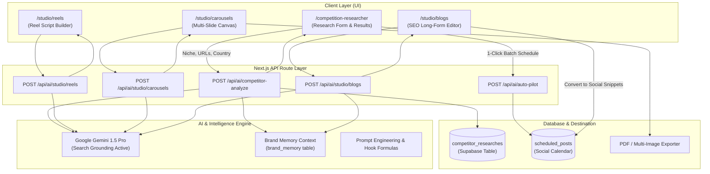

# LEMON AI — Team Member 1: Architecture & Implementation Guide
## Domain: AI Research Engine & AI Content Studio

---

### Executive Overview & Ownership

| Attribute | Details |
|---|---|
| **Role** | **AI Research & Content Studio Specialist (Member 1)** |
| **Primary Domain** | Top-of-funnel content generation, market intelligence, multi-modal studios |
| **Assigned Modules** | **Phase 1.1:** Competitor Researcher & Trend Hijacking<br>**Phase 2.1:** Reels & Short-Form Video Script Studio<br>**Phase 2.2:** Multi-Slide Carousel Creator<br>**Phase 2.3:** SEO Blog & Long-Form Article Generator |
| **Tech Stack** | Next.js 15 (App Router), React 19, Google Gemini 1.5 Flash/Pro with Search Grounding, Lucide Icons, jsPDF / html2canvas, TanStack Query |

---

## 1. System Architecture & Information Flow



---

## 2. Directory Structure to Create & Maintain

```
app/(routes)/(dashboard)/
  ├── competition-researcher/
  │   └── page.tsx                             // Main Competitor Research Dashboard
  └── studio/
      ├── reels/
      │   └── page.tsx                         // Reels & Short-Form Video Studio
      ├── carousels/
      │   └── page.tsx                         // Multi-Slide Carousel Studio
      └── blogs/
          └── page.tsx                         // SEO Long-Form Blog Generator

components/competition/
  ├── research-form.tsx                        // Form: Niche, target URLs, country, goal
  ├── research-results-dashboard.tsx           // Results display container
  ├── competitor-card.tsx                      // Strengths, weaknesses, winning angles
  ├── trending-hooks-panel.tsx                 // Viral hooks categorized by formula
  ├── recommended-hashtags.tsx                 // Tiered hashtags (Mega, Macro, Niche)
  └── schedule-from-research-dialog.tsx        // 1-Click Batch Schedule to Calendar modal

components/studio/
  ├── reels/
  │   ├── reel-script-generator.tsx            // Form + generation trigger
  │   ├── script-timeline-view.tsx             // 3-part timeline (Hook, Value, CTA)
  │   └── b-roll-suggestion-card.tsx           // Visual cues and shot guidance
  ├── carousels/
  │   ├── carousel-designer.tsx                // Slide preview & pagination
  │   ├── slide-card.tsx                       // Single slide editor & visual layout
  │   └── carousel-export-button.tsx           // jsPDF / image zip export
  └── blogs/
      ├── blog-generator-form.tsx              // Topic, target keyword, tone
      ├── blog-editor-view.tsx                 // Markdown / Rich-text renderer
      └── convert-to-posts-dialog.tsx          // Extract 3 social snippets

lib/
  └── competitor-researcher.ts                 // Core Gemini reasoning + grounding logic

app/api/ai/
  ├── competitor-analyze/
  │   └── route.ts                             // Market & competitor intelligence API
  └── studio/
      ├── reels/route.ts                       // Reel script generator API
      ├── carousels/route.ts                   // Carousel slides generator API
      └── blogs/route.ts                       // Long-form blog & schema generator API
```

---

## 3. Database Schema Requirement

Add this table to Supabase via migration SQL:

```sql
CREATE TABLE IF NOT EXISTS competitor_researches (
  id UUID PRIMARY KEY DEFAULT gen_random_uuid(),
  user_id TEXT NOT NULL,
  niche TEXT NOT NULL,
  target_audience TEXT,
  country TEXT DEFAULT 'IN',
  competitor_urls TEXT[] DEFAULT '{}',
  research_data JSONB NOT NULL,
  created_at TIMESTAMPTZ DEFAULT now()
);

ALTER TABLE competitor_researches ENABLE ROW LEVEL SECURITY;

CREATE POLICY competitor_researches_user_policy ON competitor_researches
  FOR ALL USING (user_id = requesting_user_id())
  WITH CHECK (user_id = requesting_user_id());
```

---

## 4. Detailed Component Specifications

### 4.1 Competition Researcher (`/competition-researcher`)
- **Input Parameters:**
  - `niche`: Industry or niche (e.g., *"Luxury Real Estate in Dubai"*).
  - `targetAudience`: Specific buyer persona (e.g., *"HNI investors aged 35-55"*).
  - `country`: Target market country (`IN`, `US`, `UK`, `AE`, etc.).
  - `competitorUrls`: Array of competitor social links or website URLs.
- **Output Structure (`research_data` JSONB):**
  ```typescript
  export interface CompetitorResearchOutput {
    marketTrends: string[];
    competitors: {
      name: string;
      strengths: string[];
      weaknesses: string[];
      winningHooks: string[];
    }[];
    topTrendingHooks: {
      hook: string;
      formula: "CONTRARIAN" | "PAIN_POINT" | "BEFORE_AFTER" | "STORY_LOOP";
      targetEmotion: string;
      whyItWorks: string;
    }[];
    tieredHashtags: {
      mega: string[];   // 1M+
      macro: string[];  // 100k - 1M
      niche: string[];  // <100k
    };
    contentAngles: {
      format: "REEL" | "CAROUSEL" | "SINGLE_POST";
      headline: string;
      scriptOutline: string;
      callToAction: string;
    }[];
  }
  ```

### 4.2 Reels & Short-Form Video Studio (`/studio/reels`)
- Generates precise, timed reel scripts:
  - **Hook (0-3s):** Pattern interrupt audio line + visual scroll-stopper cue.
  - **Body (4-45s):** 3-4 concise value beats with B-roll camera angle instructions.
  - **CTA (46-60s):** Explicit verbal and on-screen call-to-action (e.g., *"Comment BLUEPRINT to get the PDF"*).
- Includes teleprompter / copy-to-clipboard view with adjustable font size.

### 4.3 Multi-Slide Carousel Creator (`/studio/carousels`)
- Generates 5 to 10 sequential slides:
  - Slide 1: High-contrast cover slide with hook question or bold claim.
  - Slide 2–N-1: Bite-sized actionable insights (max 35 words per slide).
  - Slide N: Save/Share prompt + profile follow CTA.
- Direct **Export as PDF** formatted to 1080x1350px (Instagram 4:5 ratio / LinkedIn Document Post standard).

### 4.4 SEO Blog & Long-Form Generator (`/studio/blogs`)
- Grounded in `brand_memory` so it references actual product specs and brand tone.
- Generates complete markdown article with:
  - Meta Title (55-60 chars) and Meta Description (150-160 chars).
  - Hierarchical headings (`# H1`, `## H2`, `### H3`).
  - JSON-LD FAQ Schema markup.
  - **"Auto-Convert"** button that extracts 3 punchy social posts and sends them to `/schedule`.

---

## 5. Step-by-Step Task Checklist for Member 1

- [ ] **Sprint 1 (Immediate - Phase 1.1)**
  - [ ] Execute `competitor_researches` migration in Supabase.
  - [ ] Create `lib/competitor-researcher.ts` utilizing `routeAICall` from `lib/ai-router.ts`.
  - [ ] Build API route `app/api/ai/competitor-analyze/route.ts`.
  - [ ] Build page `app/(routes)/(dashboard)/competition-researcher/page.tsx`.
  - [ ] Build UI components: `research-form.tsx`, `trending-hooks-panel.tsx`, `competitor-card.tsx`, `recommended-hashtags.tsx`.
  - [ ] Build `schedule-from-research-dialog.tsx` to automatically push research hooks into `/api/ai/auto-pilot` for immediate scheduling.
  - [ ] Add navigation link for "Researcher" into `app-sidebar.tsx`.

- [ ] **Sprint 2 (Phase 2.1 & 2.2)**
  - [ ] Build API route `app/api/ai/studio/reels/route.ts`.
  - [ ] Build page `app/(routes)/(dashboard)/studio/reels/page.tsx` with 3-part script timeline preview.
  - [ ] Build API route `app/api/ai/studio/carousels/route.ts`.
  - [ ] Build page `app/(routes)/(dashboard)/studio/carousels/page.tsx` with slide pagination canvas.
  - [ ] Implement client-side PDF export using `jspdf` or HTML canvas rendering.

- [ ] **Sprint 3 (Phase 2.3)**
  - [ ] Build API route `app/api/ai/studio/blogs/route.ts` grounded in `brand_memory`.
  - [ ] Build page `app/(routes)/(dashboard)/studio/blogs/page.tsx` with Markdown editor and preview tabs.
  - [ ] Implement 1-click "Repurpose into Social Posts" modal linking to calendar post creator.
