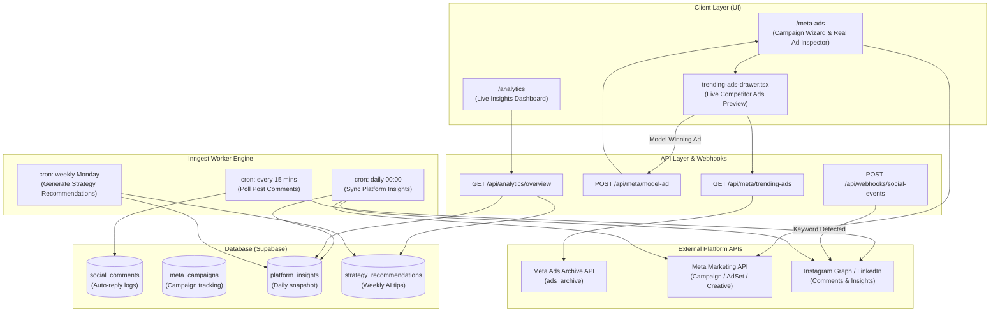

# LEMON AI — Team Member 2: Architecture & Implementation Guide
## Domain: Paid Ads Engine, Background Social Workers & Growth Analytics

---

### Executive Overview & Ownership

| Attribute | Details |
|---|---|
| **Role** | **Ads Engine, Social Workers & Growth Analytics Specialist (Member 2)** |
| **Primary Domain** | Meta Ads ecosystem, live ads intelligence, Inngest background polling, automated social engagement, and analytics |
| **Assigned Modules** | **Phase 1.2:** Meta Ads AI Intelligence & Live Ads Library Engine<br>**Phase 3.1:** Intelligent Auto-Reply to Post Comments<br>**Phase 3.2:** Social DM Lead Automation<br>**Phase 7.1:** Live Platform Insights Dashboard<br>**Phase 7.2:** Autonomous Strategy Optimization Agent |
| **Tech Stack** | Meta Graph API v21.0 (`ads_archive`, `insights`, `adaccount`), Inngest Serverless Workers, Supabase PostgreSQL, TanStack Query, Recharts / Tremor |

---

## 1. System Architecture & Information Flow



---

## 2. Directory Structure to Create & Maintain

```
app/(routes)/(dashboard)/
  ├── meta-ads/                                // Existing (Enhance with Live Library)
  │   └── page.tsx
  └── analytics/
      └── page.tsx                             // Live Platform & Ads Insights Dashboard

components/meta-ads/
  ├── trending-ads-drawer.tsx                  // Live drawer showing real competitor Meta ads
  ├── ad-intelligence-card.tsx                 // Card showing competitor ad copy, headline, CTA
  └── campaign-creation-wizard.tsx             // Inject "Inspect Competitor Ads" & "Model Winning Ad"

components/analytics/
  ├── analytics-overview-cards.tsx             // Impressions, CTR, ROAS, Total Spend
  ├── platform-breakdown-chart.tsx             // Reach & Engagement by platform (IG, LinkedIn, FB)
  ├── ads-roas-table.tsx                       // Campaign-level ROI & conversion tracking
  └── ai-optimizer-card.tsx                    // Weekly autonomous optimization suggestions

lib/
  ├── meta-ads-library.ts                      // Meta Ads Archive client (Live competitor scraping)
  └── analytics-service.ts                     // Instagram, LinkedIn & Meta Ads performance aggregators

inngest/functions/
  ├── monitor-post-comments.ts                 // Polling job: Fetch comments, analyze sentiment, reply
  ├── sync-platform-analytics.ts               // Daily cron: Pull reach, CTR, ROAS from platforms
  └── generate-strategy-recommendations.ts     // Weekly cron: Autonomous strategy optimization

app/api/
  ├── meta/
  │   ├── trending-ads/route.ts                // Query Meta Ads Archive
  │   └── model-ad/route.ts                    // AI Rewrite / clone competitor ad
  ├── analytics/
  │   └── overview/route.ts                    // Aggregated metrics endpoint
  └── webhooks/
      └── social-events/route.ts               // Instant webhook for DM keyword automations
```

---

## 3. Database Schema Requirement

Add these tables to Supabase via migration SQL:

```sql
-- 1. SOCIAL COMMENTS AUTO-REPLY LOGS
CREATE TABLE IF NOT EXISTS social_comments (
  id UUID PRIMARY KEY DEFAULT gen_random_uuid(),
  user_id TEXT NOT NULL,
  post_id UUID REFERENCES scheduled_posts(id) ON DELETE CASCADE,
  platform TEXT NOT NULL,
  platform_comment_id TEXT,
  commenter_handle TEXT,
  comment_text TEXT NOT NULL,
  sentiment TEXT, -- inquiry, praise, complaint, spam
  reply_text TEXT,
  status TEXT DEFAULT 'replied',
  created_at TIMESTAMPTZ DEFAULT now()
);

ALTER TABLE social_comments ENABLE ROW LEVEL SECURITY;
CREATE POLICY social_comments_user_policy ON social_comments
  FOR ALL USING (user_id = requesting_user_id())
  WITH CHECK (user_id = requesting_user_id());

-- 2. DAILY ANALYTICS SNAPSHOTS
CREATE TABLE IF NOT EXISTS platform_insights (
  id UUID PRIMARY KEY DEFAULT gen_random_uuid(),
  user_id TEXT NOT NULL,
  snapshot_date DATE NOT NULL DEFAULT CURRENT_DATE,
  platform TEXT NOT NULL, -- meta_ads, instagram, linkedin, twitter
  impressions INTEGER DEFAULT 0,
  reach INTEGER DEFAULT 0,
  clicks INTEGER DEFAULT 0,
  engagement_rate NUMERIC DEFAULT 0,
  spend NUMERIC DEFAULT 0,
  revenue_attributed NUMERIC DEFAULT 0,
  metadata JSONB DEFAULT '{}',
  created_at TIMESTAMPTZ DEFAULT now(),
  UNIQUE(user_id, snapshot_date, platform)
);

ALTER TABLE platform_insights ENABLE ROW LEVEL SECURITY;
CREATE POLICY platform_insights_user_policy ON platform_insights
  FOR ALL USING (user_id = requesting_user_id())
  WITH CHECK (user_id = requesting_user_id());

-- 3. AI STRATEGY OPTIMIZATION RECOMMENDATIONS
CREATE TABLE IF NOT EXISTS strategy_recommendations (
  id UUID PRIMARY KEY DEFAULT gen_random_uuid(),
  user_id TEXT NOT NULL,
  category TEXT NOT NULL, -- budget_reallocation, content_format, timing
  headline TEXT NOT NULL,
  recommendation TEXT NOT NULL,
  impact_score INTEGER DEFAULT 8,
  applied BOOLEAN DEFAULT false,
  created_at TIMESTAMPTZ DEFAULT now()
);

ALTER TABLE strategy_recommendations ENABLE ROW LEVEL SECURITY;
CREATE POLICY strategy_recommendations_user_policy ON strategy_recommendations
  FOR ALL USING (user_id = requesting_user_id())
  WITH CHECK (user_id = requesting_user_id());
```

---

## 4. Detailed Component Specifications

### 4.1 Live Meta Ads Library Engine (`lib/meta-ads-library.ts`)
- Queries Meta Graph API `ads_archive`:
  - `ad_reached_countries`: `['IN']` or target country.
  - `search_terms`: User niche / competitor keyword.
  - `ad_active_status`: `'ACTIVE'`.
  - `fields`: `id, ad_creative_bodies, ad_creative_link_titles, ad_creative_link_captions, ad_delivery_start_time, publisher_platforms, snapshot_url`.
- Returns sanitized array of active competitor ads with headline, body, and CTA type.

### 4.2 Enhanced Campaign Creation Wizard (`components/meta-ads/`)
- In Step 1 of `campaign-creation-wizard.tsx`:
  - Add **"Inspect Competitor Meta Ads"** button.
  - Opens `trending-ads-drawer.tsx` displaying live competitor ads in the niche.
  - User clicks **"Model Winning Ad"** on any ad card -> calls `/api/meta/model-ad`.
  - AI writes unique, high-converting copy, headlines, and descriptions tailored to the user's brand and injects them directly into Step 2 of the wizard.

### 4.3 Inngest Comment Polling Worker (`inngest/functions/monitor-post-comments.ts`)
- Runs every 15 minutes.
- Iterates over posts published in the last 7 days.
- Fetches new comments via platform APIs.
- Classifies sentiment using Gemini Flash (cost-efficient):
  - If **Purchase Intent** (*"Price?", "Link?"*): Replies with public friendly message and triggers private DM webhook.
  - If **Praise / General**: Replies with warm brand-voice reply.
  - If **Spam / Troll**: Flags and ignores.
- Logs reply in `social_comments` table.

### 4.4 Live Analytics Dashboard (`/analytics`)
- Aggregates:
  - **Organic Social:** Reach, impressions, followers gained, top-performing post format.
  - **Meta Ads:** Real Ad Spend, Impressions, Link Clicks, Average CPC, and ROAS.
- Displays AI Strategy Optimizer recommendations at the top with 1-click apply.

---

## 5. Step-by-Step Task Checklist for Member 2

- [ ] **Sprint 1 (Immediate - Phase 1.2)**
  - [ ] Implement `lib/meta-ads-library.ts` to call Meta's `ads_archive` endpoint.
  - [ ] Build API route `app/api/meta/trending-ads/route.ts`.
  - [ ] Build API route `app/api/meta/model-ad/route.ts` using Gemini to clone/adapt competitor ads.
  - [ ] Build `components/meta-ads/trending-ads-drawer.tsx` and `ad-intelligence-card.tsx`.
  - [ ] Connect the drawer into `components/meta-ads/campaign-creation-wizard.tsx`.

- [ ] **Sprint 2 (Phase 3.1 & 3.2)**
  - [ ] Execute `social_comments` migration in Supabase.
  - [ ] Build Inngest worker `inngest/functions/monitor-post-comments.ts`.
  - [ ] Register the function in `inngest/client.ts` and `app/api/inngest/route.ts`.
  - [ ] Build webhook handler `app/api/webhooks/social-events/route.ts` to handle instant DM triggers.

- [ ] **Sprint 3 (Phase 7.1 & 7.2)**
  - [ ] Execute `platform_insights` and `strategy_recommendations` migrations.
  - [ ] Build `lib/analytics-service.ts` to query Meta Ads Insights & social metrics.
  - [ ] Build API route `app/api/analytics/overview/route.ts`.
  - [ ] Build page `app/(routes)/(dashboard)/analytics/page.tsx`.
  - [ ] Build UI components: `analytics-overview-cards.tsx`, `platform-breakdown-chart.tsx`, `ads-roas-table.tsx`.
  - [ ] Build Inngest cron worker `inngest/functions/generate-strategy-recommendations.ts`.
  - [ ] Add "Analytics" link to `app-sidebar.tsx`.
