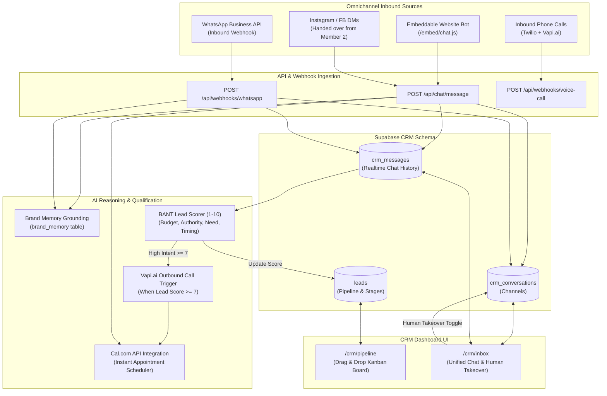

# LEMON AI — Team Member 3: Architecture & Implementation Guide
## Domain: Unified CRM, Conversational Bots & Voice AI Calling Agent

---

### Executive Overview & Ownership

| Attribute | Details |
|---|---|
| **Role** | **Unified CRM, Conversational Bots & Voice AI Specialist (Member 3)** |
| **Primary Domain** | Lead capture & qualification, multi-channel conversations, CRM pipeline, and autonomous voice calling |
| **Assigned Modules** | **Phase 4.1:** Embeddable Website Chatbot<br>**Phase 4.2:** WhatsApp Business Bot<br>**Phase 4.3:** Automated Lead Scoring & Appointment Booking (Cal.com)<br>**Phase 5.1:** Leads Kanban Pipeline<br>**Phase 5.2:** Unified Omnichannel Inbox<br>**Phase 6.1:** Outbound AI Lead Qualification Calls<br>**Phase 6.2:** Inbound AI Receptionist |
| **Tech Stack** | Supabase (PostgreSQL, Realtime subscriptions, RLS), Vapi.ai / Bland.ai Voice APIs, Twilio, WhatsApp Cloud API, Cal.com / Google Calendar API, dnd-kit / react-beautiful-dnd |

---

## 1. System Architecture & Information Flow



---

## 2. Directory Structure to Create & Maintain

```
app/(routes)/(dashboard)/crm/
  ├── pipeline/
  │   └── page.tsx                             // Deals & Leads Kanban Pipeline
  └── inbox/
      └── page.tsx                             // Unified Omnichannel Inbox

app/api/
  ├── crm/
  │   ├── leads/route.ts                       // Leads CRUD & stage update
  │   └── conversations/route.ts               // Conversations & messages endpoint
  ├── chat/
  │   └── message/route.ts                     // Website Chatbot message processing
  ├── webhooks/
  │   ├── whatsapp/route.ts                    // WhatsApp Cloud API webhook
  │   └── voice-events/route.ts                // Vapi.ai / Bland.ai call status webhook
  └── voice/
      └── call-lead/route.ts                   // Trigger automated outbound call

components/crm/
  ├── pipeline/
  │   ├── kanban-board.tsx                     // Drag-and-drop board
  │   ├── kanban-column.tsx                    // Stage column (New, Qualified, Booked, etc.)
  │   ├── lead-card.tsx                        // Lead card with score badge & deal value
  │   └── lead-detail-dialog.tsx               // Lead modal: info, score breakdown, call log
  ├── inbox/
  │   ├── conversation-list.tsx                // Active threads (WA, Web, IG, FB)
  │   ├── chat-window.tsx                      // Live message stream with Realtime
  │   ├── chat-input.tsx                       // Reply box + canned responses
  │   └── human-takeover-banner.tsx            // "AI is Paused - Human Agent Active" toggle
  └── public-widget/
      └── website-chat-widget.tsx              // Standalone embeddable chat bubble

lib/
  ├── crm-service.ts                           // Leads & conversations queries
  ├── lead-scoring.ts                          // BANT intent scoring logic
  ├── vapi-client.ts                           // Vapi.ai voice integration client
  ├── whatsapp-client.ts                       // Meta WhatsApp Cloud API helper
  └── calcom-client.ts                         // Cal.com / Google Calendar integration
```

---

## 3. Database Schema Requirement

Execute this migration in Supabase SQL Editor:

```sql
-- 1. LEADS & PIPELINE TABLE
CREATE TABLE IF NOT EXISTS leads (
  id UUID PRIMARY KEY DEFAULT gen_random_uuid(),
  user_id TEXT NOT NULL,
  name TEXT,
  email TEXT,
  phone TEXT,
  source TEXT DEFAULT 'organic', -- organic, meta_ads, website, whatsapp, inbound_call
  stage TEXT DEFAULT 'new',       -- new, contacted, qualified, booked, proposal, closed_won, closed_lost
  score INTEGER DEFAULT 0,       -- 0 to 10
  deal_value NUMERIC DEFAULT 0,
  metadata JSONB DEFAULT '{}',
  created_at TIMESTAMPTZ DEFAULT now(),
  updated_at TIMESTAMPTZ DEFAULT now()
);

ALTER TABLE leads ENABLE ROW LEVEL SECURITY;
CREATE POLICY leads_user_policy ON leads
  FOR ALL USING (user_id = requesting_user_id())
  WITH CHECK (user_id = requesting_user_id());

-- 2. CRM CONVERSATIONS
CREATE TABLE IF NOT EXISTS crm_conversations (
  id UUID PRIMARY KEY DEFAULT gen_random_uuid(),
  user_id TEXT NOT NULL,
  lead_id UUID REFERENCES leads(id) ON DELETE CASCADE,
  channel TEXT NOT NULL, -- website, whatsapp, instagram, facebook, voice
  status TEXT DEFAULT 'open', -- open, resolved, snoozed
  is_ai_active BOOLEAN DEFAULT true, -- toggles human handover
  last_message_at TIMESTAMPTZ DEFAULT now(),
  created_at TIMESTAMPTZ DEFAULT now()
);

ALTER TABLE crm_conversations ENABLE ROW LEVEL SECURITY;
CREATE POLICY crm_conversations_user_policy ON crm_conversations
  FOR ALL USING (user_id = requesting_user_id())
  WITH CHECK (user_id = requesting_user_id());

-- 3. CRM MESSAGES (REALTIME ENABLED)
CREATE TABLE IF NOT EXISTS crm_messages (
  id UUID PRIMARY KEY DEFAULT gen_random_uuid(),
  conversation_id UUID REFERENCES crm_conversations(id) ON DELETE CASCADE,
  sender_type TEXT NOT NULL CHECK (sender_type IN ('lead', 'ai_assistant', 'human_agent')),
  content TEXT NOT NULL,
  created_at TIMESTAMPTZ DEFAULT now()
);

ALTER TABLE crm_messages ENABLE ROW LEVEL SECURITY;
CREATE POLICY crm_messages_user_policy ON crm_messages
  FOR ALL USING (conversation_id IN (SELECT id FROM crm_conversations WHERE user_id = requesting_user_id()));

-- Enable Supabase Realtime for instant chat
ALTER PUBLICATION supabase_realtime ADD TABLE crm_messages;
```

---

## 4. Detailed Component Specifications

### 4.1 Leads Kanban Pipeline (`/crm/pipeline`)
- Stages:
  1. **New Lead** (Auto-created when web visitor gives email/phone or comments).
  2. **Contacted** (Initial auto-reply / DM / WhatsApp sent).
  3. **Qualified** (Lead score ≥ 7 based on BANT).
  4. **Appointment Booked** (Cal.com booking confirmed).
  5. **Proposal Sent** (High-ticket quote provided).
  6. **Closed Won / Closed Lost**.
- Smooth drag-and-drop cards showing: Lead name, contact, intent score badge (Green: 8-10, Amber: 5-7, Gray: 1-4), and total column monetary value.

### 4.2 Unified Omnichannel Inbox (`/crm/inbox`)
- Left column: Unified thread list with channel icons (WhatsApp icon, Website chat icon, Instagram logo).
- Center column: Realtime chat conversation.
- Top bar: **"AI Takeover Switch"**: When the human agent types or flips the switch to `Human`, AI auto-replies are paused for that conversation.
- Right sidebar: Lead profile summary, lead score, deal value, and Cal.com booking link shortcut.

### 4.3 Embeddable Website Chatbot (`components/crm/public-widget/`)
- Public, responsive floating chat bubble widget.
- Grounded strictly in the user's `brand_memory` (answers FAQs, services, pricing).
- Naturally asks: *"What is the best email or phone number to send our portfolio / pricing sheet to?"*
- Upon receiving contact info, automatically creates an entry in `leads` and triggers scoring.

### 4.4 Automated AI Voice Calling Agent (`lib/vapi-client.ts`)
- Configures Vapi.ai / Bland.ai assistant with company prompt and tone.
- **Outbound Trigger:** When `leads.score >= 7` or stage changes to `qualified`, fires `/api/voice/call-lead`.
- AI voice assistant calls the lead, introduces the brand, asks qualification questions, and offers to book a discovery call.
- Webhook `/api/webhooks/voice-events` logs the call transcript and recording URL into the lead's profile.

---

## 5. Step-by-Step Task Checklist for Member 3

- [ ] **Sprint 1 (Database & CRM Pipeline Foundation)**
  - [ ] Execute `leads`, `crm_conversations`, and `crm_messages` SQL migration in Supabase.
  - [ ] Build `lib/crm-service.ts` for leads and conversation queries.
  - [ ] Build API routes `app/api/crm/leads/route.ts` and `app/api/crm/conversations/route.ts`.
  - [ ] Build page `app/(routes)/(dashboard)/crm/pipeline/page.tsx`.
  - [ ] Implement drag-and-drop Kanban board with stage updates.
  - [ ] Add "Pipeline" link to `app-sidebar.tsx`.

- [ ] **Sprint 2 (Unified Inbox & Website Chatbot)**
  - [ ] Build page `app/(routes)/(dashboard)/crm/inbox/page.tsx`.
  - [ ] Implement Supabase Realtime channel subscription for `crm_messages`.
  - [ ] Build `human-takeover-banner.tsx` to pause/resume AI assistant.
  - [ ] Build embeddable website chatbot widget in `components/crm/public-widget/`.
  - [ ] Build API route `app/api/chat/message/route.ts` with brand memory grounding.
  - [ ] Add "Inbox" link to `app-sidebar.tsx`.

- [ ] **Sprint 3 (WhatsApp, Lead Scoring & Calendar Booking)**
  - [ ] Implement `lib/lead-scoring.ts` (BANT intent evaluation returning 1-10).
  - [ ] Integrate Cal.com API in `lib/calcom-client.ts`.
  - [ ] Implement WhatsApp Cloud API webhook in `app/api/webhooks/whatsapp/route.ts`.
  - [ ] Verify automatic stage transition: `new` → `qualified` → `booked`.

- [ ] **Sprint 4 (AI Voice Calling Agent)**
  - [ ] Set up Vapi.ai / Bland.ai account credentials in `.env.local`.
  - [ ] Implement `lib/vapi-client.ts` with conversational prompt & phone number bindings.
  - [ ] Build API route `app/api/voice/call-lead/route.ts`.
  - [ ] Build webhook `app/api/webhooks/voice-events/route.ts` to log call recordings & transcripts into CRM lead notes.
